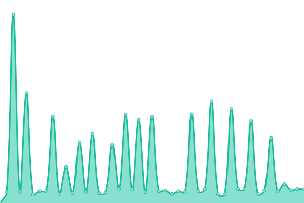
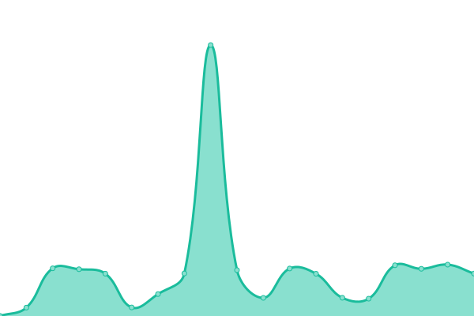
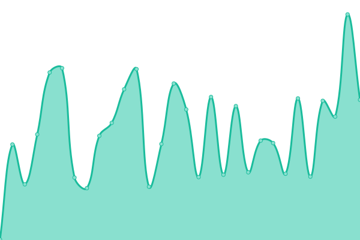

# [📈 Live Status](https://Sumukha.github.io/upptime): <!--live status--> **🟩 All systems operational**

This repository contains the open-source uptime monitor and status page for [Sumukha](https://Sumukha.github.io/upptime), powered by [Upptime](https://github.com/upptime/upptime).

With [Upptime](https://upptime.js.org), you can get your own unlimited and free uptime monitor and status page, powered entirely by a GitHub repository. We use [Issues](https://github.com/Sumukha/upptime/issues) as incident reports, [Actions](https://github.com/Sumukha/upptime/actions) as uptime monitors, and [Pages](https://Sumukha.github.io/upptime) for the status page.

<!--start: status pages-->
<!-- This summary is generated by Upptime (https://github.com/upptime/upptime) -->
<!-- Do not edit this manually, your changes will be overwritten -->
<!-- prettier-ignore -->
| URL | Status | History | Response Time | Uptime |
| --- | ------ | ------- | ------------- | ------ |
|  [AWFL](https://awebsiteforlawyers.com) | 🟩 Up | [awfl.yml](https://github.com/Sumukha/upptime/commits/HEAD/history/awfl.yml) | 

 1255ms
     
 | 

<a href="https://sumukha.github.io/upptime/history/awfl">100.00%</a>
    

|  [SedWeb](https://sedonawebsitedesign.com) | 🟩 Up | [sed-web.yml](https://github.com/Sumukha/upptime/commits/HEAD/history/sed-web.yml) | 

 506ms
     
 | 

<a href="https://sumukha.github.io/upptime/history/sed-web">100.00%</a>
    

|  [SBWeb](https://santabarbara-webdesign.com) | 🟩 Up | [sb-web.yml](https://github.com/Sumukha/upptime/commits/HEAD/history/sb-web.yml) | 

 460ms
     
 | 

<a href="https://sumukha.github.io/upptime/history/sb-web">100.00%</a>
    

|  [Google](https://www.google.com) | 🟩 Up | [google.yml](https://github.com/Sumukha/upptime/commits/HEAD/history/google.yml) | 

 107ms
     
 | 

<a href="https://sumukha.github.io/upptime/history/google">100.00%</a>
    

<!--end: status pages-->

[**Visit our status website →**](https://Sumukha.github.io/upptime)

## 📄 License

- Powered by: [Upptime](https://github.com/upptime/upptime)
- Code: [MIT](./LICENSE) © [Anand Chowdhary](https://anandchowdhary.com), supported by [Pabio](https://pabio.com)
- Data in the `./history` directory: [Open Database License](https://opendatacommons.org/licenses/odbl/1-0/)
