# [📈 Live Status](https://Sumukha.github.io/upptime): <!--live status--> **🟩 All systems operational**

This repository contains the open-source uptime monitor and status page for [Sumukha](https://Sumukha.github.io/upptime), powered by [Upptime](https://github.com/upptime/upptime).

With [Upptime](https://upptime.js.org), you can get your own unlimited and free uptime monitor and status page, powered entirely by a GitHub repository. We use [Issues](https://github.com/Sumukha/upptime/issues) as incident reports, [Actions](https://github.com/Sumukha/upptime/actions) as uptime monitors, and [Pages](https://Sumukha.github.io/upptime) for the status page.

<!--start: status pages-->
<!-- This summary is generated by Upptime (https://github.com/upptime/upptime) -->
<!-- Do not edit this manually, your changes will be overwritten -->
<!-- prettier-ignore -->
| URL | Status | History | Response Time | Uptime |
| --- | ------ | ------- | ------------- | ------ |
|  [AWFL](https://awebsiteforlawyers.com) | 🟩 Up | [awfl.yml](https://github.com/Sumukha/upptime/commits/HEAD/history/awfl.yml) | 

 1835ms
     
 | 

<a href="https://sumukha.github.io/upptime/history/awfl">94.96%</a>
    

|  [SedWeb](https://sedonawebsitedesign.com) | 🟩 Up | [sed-web.yml](https://github.com/Sumukha/upptime/commits/HEAD/history/sed-web.yml) | 

 419ms
     
 | 

<a href="https://sumukha.github.io/upptime/history/sed-web">99.39%</a>
    

|  [SBWeb](https://santabarbara-webdesign.com) | 🟩 Up | [sb-web.yml](https://github.com/Sumukha/upptime/commits/HEAD/history/sb-web.yml) | 

 289ms
     
 | 

<a href="https://sumukha.github.io/upptime/history/sb-web">99.81%</a>
    

|  [wla1.wndp.pt](https://wla1.wndp.pt) | 🟩 Up | [wla1-wndp-pt.yml](https://github.com/Sumukha/upptime/commits/HEAD/history/wla1-wndp-pt.yml) | 

 280ms
     
 | 

<a href="https://sumukha.github.io/upptime/history/wla1-wndp-pt">100.00%</a>
    

|  [Admark](https://admarkimprint.com) | 🟩 Up | [admark.yml](https://github.com/Sumukha/upptime/commits/HEAD/history/admark.yml) | 

 265ms
     
 | 

<a href="https://sumukha.github.io/upptime/history/admark">100.00%</a>
    

|  [Ami Sarasvati](https://amisarasvati.com) | 🟩 Up | [ami-sarasvati.yml](https://github.com/Sumukha/upptime/commits/HEAD/history/ami-sarasvati.yml) | 

 341ms
     
 | 

<a href="https://sumukha.github.io/upptime/history/ami-sarasvati">99.39%</a>
    

|  [Ami learntoplaynaf.com](https://learntoplaynaf.com) | 🟩 Up | [ami-learntoplaynaf-com.yml](https://github.com/Sumukha/upptime/commits/HEAD/history/ami-learntoplaynaf-com.yml) | 

 2301ms
     
 | 

<a href="https://sumukha.github.io/upptime/history/ami-learntoplaynaf-com">100.00%</a>
    

|  [Ami learntoplaynaf.com/learn/](https://learntoplaynaf.com/learn/) | 🟩 Up | [ami-learntoplaynaf-com-learn.yml](https://github.com/Sumukha/upptime/commits/HEAD/history/ami-learntoplaynaf-com-learn.yml) | 

 36ms
     
 | 

<a href="https://sumukha.github.io/upptime/history/ami-learntoplaynaf-com-learn">100.00%</a>
    

|  [andykeglerhomesolutions.com](https://andykeglerhomesolutions.com) | 🟩 Up | [andykeglerhomesolutions-com.yml](https://github.com/Sumukha/upptime/commits/HEAD/history/andykeglerhomesolutions-com.yml) | 

 3807ms
     
 | 

<a href="https://sumukha.github.io/upptime/history/andykeglerhomesolutions-com">99.39%</a>
    

|  [appliedintuition.org](https://appliedintuition.org) | 🟩 Up | [appliedintuition-org.yml](https://github.com/Sumukha/upptime/commits/HEAD/history/appliedintuition-org.yml) | 

 491ms
     
 | 

<a href="https://sumukha.github.io/upptime/history/appliedintuition-org">99.40%</a>
    

|  [ANHA](https://aznaturalhistory.org) | 🟩 Up | [anha.yml](https://github.com/Sumukha/upptime/commits/HEAD/history/anha.yml) | 

 526ms
     
 | 

<a href="https://sumukha.github.io/upptime/history/anha">98.52%</a>
    

|  [auracolorlight.com](https://auracolorlight.com) | 🟩 Up | [auracolorlight-com.yml](https://github.com/Sumukha/upptime/commits/HEAD/history/auracolorlight-com.yml) | 

 1683ms
     
 | 

<a href="https://sumukha.github.io/upptime/history/auracolorlight-com">100.00%</a>
    

|  [BigPark](https://bigparkcouncil.org) | 🟩 Up | [big-park.yml](https://github.com/Sumukha/upptime/commits/HEAD/history/big-park.yml) | 

 1513ms
     
 | 

<a href="https://sumukha.github.io/upptime/history/big-park">100.00%</a>
    

|  [BBFD](https://bodyblissfactorydirect.com/) | 🟩 Up | [bbfd.yml](https://github.com/Sumukha/upptime/commits/HEAD/history/bbfd.yml) | 

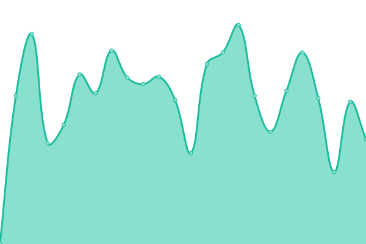 269ms
     
 | 

<a href="https://sumukha.github.io/upptime/history/bbfd">100.00%</a>
    

|  [Brent W Davis](https://brentwdavis.com) | 🟩 Up | [brent-w-davis.yml](https://github.com/Sumukha/upptime/commits/HEAD/history/brent-w-davis.yml) | 

 381ms
     
 | 

<a href="https://sumukha.github.io/upptime/history/brent-w-davis">99.41%</a>
    

|  [BrentWDavisLaw](https://brentwdavislaw.com) | 🟩 Up | [brent-w-davis-law.yml](https://github.com/Sumukha/upptime/commits/HEAD/history/brent-w-davis-law.yml) | 

 1635ms
     
 | 

<a href="https://sumukha.github.io/upptime/history/brent-w-davis-law">100.00%</a>
    

|  [brigittegarzalaw.com](https://brigittegarzalaw.com) | 🟩 Up | [brigittegarzalaw-com.yml](https://github.com/Sumukha/upptime/commits/HEAD/history/brigittegarzalaw-com.yml) | 

 420ms
     
 | 

<a href="https://sumukha.github.io/upptime/history/brigittegarzalaw-com">98.87%</a>
    

|  [Clayton Nolte](https://claytonnolte.com/) | 🟩 Up | [clayton-nolte.yml](https://github.com/Sumukha/upptime/commits/HEAD/history/clayton-nolte.yml) | 

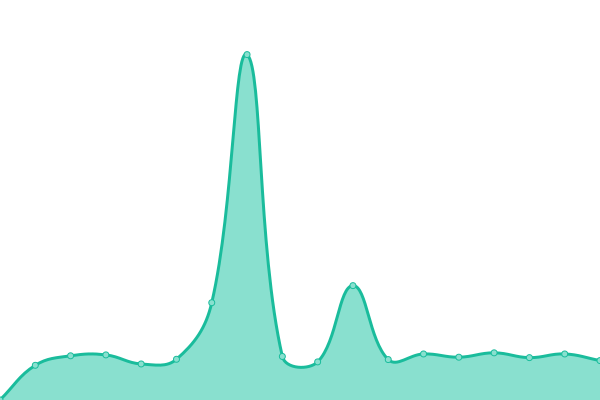 1411ms
     
 | 

<a href="https://sumukha.github.io/upptime/history/clayton-nolte">99.42%</a>
    

|  [Cove Alaska](https://covealaska.com) | 🟩 Up | [cove-alaska.yml](https://github.com/Sumukha/upptime/commits/HEAD/history/cove-alaska.yml) | 

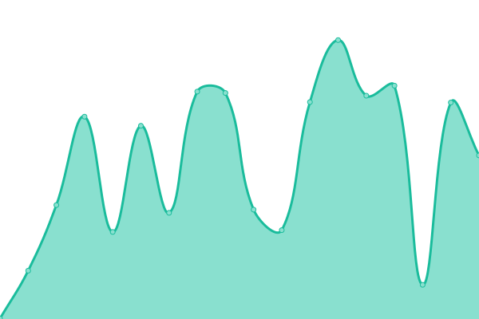 459ms
     
 | 

<a href="https://sumukha.github.io/upptime/history/cove-alaska">99.42%</a>
    

|  [Dentalstartupguy](https://dentalstartupguy.com/) | 🟩 Up | [dentalstartupguy.yml](https://github.com/Sumukha/upptime/commits/HEAD/history/dentalstartupguy.yml) | 

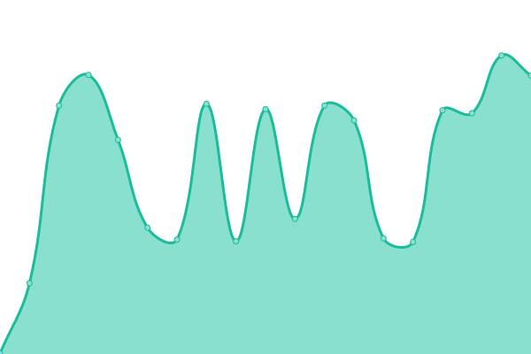 396ms
     
 | 

<a href="https://sumukha.github.io/upptime/history/dentalstartupguy">99.85%</a>
    

|  [Enerpro](https://www.enerpro-inc.com/) | 🟩 Up | [enerpro.yml](https://github.com/Sumukha/upptime/commits/HEAD/history/enerpro.yml) | 

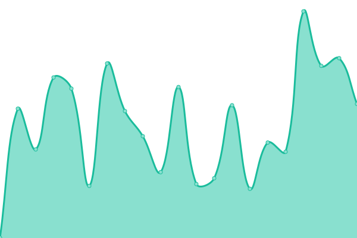 487ms
     
 | 

<a href="https://sumukha.github.io/upptime/history/enerpro">100.00%</a>
    

|  [Earthangelsinsedona](https://earthangelsinsedona.com/) | 🟩 Up | [earthangelsinsedona.yml](https://github.com/Sumukha/upptime/commits/HEAD/history/earthangelsinsedona.yml) | 

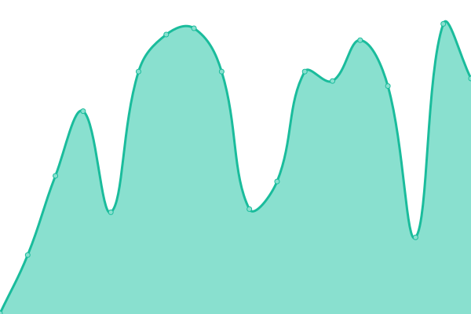 382ms
     
 | 

<a href="https://sumukha.github.io/upptime/history/earthangelsinsedona">99.04%</a>
    

|  [energyempoweredjewelry.com](https://energyempoweredjewelry.com/) | 🟩 Up | [energyempoweredjewelry-com.yml](https://github.com/Sumukha/upptime/commits/HEAD/history/energyempoweredjewelry-com.yml) | 

 1478ms
     
 | 

<a href="https://sumukha.github.io/upptime/history/energyempoweredjewelry-com">99.18%</a>
    

|  [Greenway](https://greenwaybankruptcy.com/) | 🟩 Up | [greenway.yml](https://github.com/Sumukha/upptime/commits/HEAD/history/greenway.yml) | 

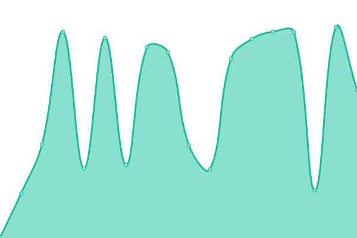 390ms
     
 | 

<a href="https://sumukha.github.io/upptime/history/greenway">100.00%</a>
    

|  [Immigration Lawyer News](https://immigration-lawyer-news.com/) | 🟩 Up | [immigration-lawyer-news.yml](https://github.com/Sumukha/upptime/commits/HEAD/history/immigration-lawyer-news.yml) | 

 285ms
     
 | 

<a href="https://sumukha.github.io/upptime/history/immigration-lawyer-news">99.81%</a>
    

|  [iPipoles](https://ipipoles.com/) | 🟩 Up | [i-pipoles.yml](https://github.com/Sumukha/upptime/commits/HEAD/history/i-pipoles.yml) | 

 419ms
     
 | 

<a href="https://sumukha.github.io/upptime/history/i-pipoles">99.05%</a>
    

|  [Jacopo](https://jacopogiacopuzzi.com) | 🟩 Up | [jacopo.yml](https://github.com/Sumukha/upptime/commits/HEAD/history/jacopo.yml) | 

 4404ms
     
 | 

<a href="https://sumukha.github.io/upptime/history/jacopo">99.05%</a>
    

|  [iPalpiti](https://ipalpiti.org) | 🟩 Up | [i-palpiti.yml](https://github.com/Sumukha/upptime/commits/HEAD/history/i-palpiti.yml) | 

 435ms
     
 | 

<a href="https://sumukha.github.io/upptime/history/i-palpiti">100.00%</a>
    

|  [Orozonaoils.com](https://orozonaoils.com/) | 🟩 Up | [orozonaoils-com.yml](https://github.com/Sumukha/upptime/commits/HEAD/history/orozonaoils-com.yml) | 

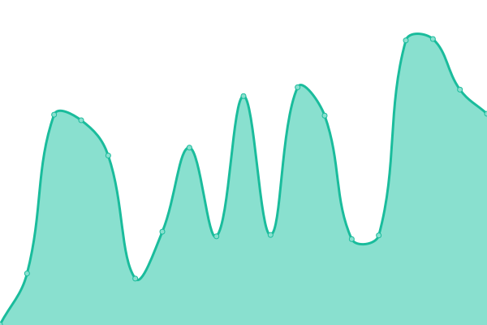 374ms
     
 | 

<a href="https://sumukha.github.io/upptime/history/orozonaoils-com">100.00%</a>
    

|  [Pernicelaw.com](https://pernicelaw.com) | 🟩 Up | [pernicelaw-com.yml](https://github.com/Sumukha/upptime/commits/HEAD/history/pernicelaw-com.yml) | 

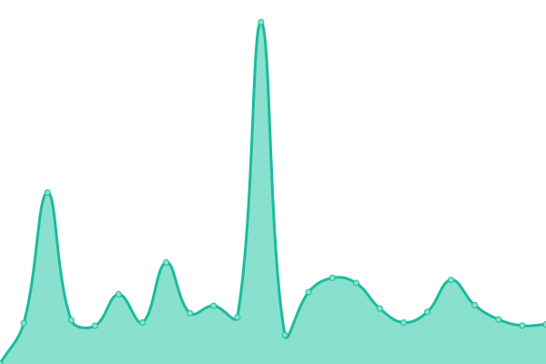 360ms
     
 | 

<a href="https://sumukha.github.io/upptime/history/pernicelaw-com">100.00%</a>
    

|  [Pryor](https://pryorimmigration.com) | 🟩 Up | [pryor.yml](https://github.com/Sumukha/upptime/commits/HEAD/history/pryor.yml) | 

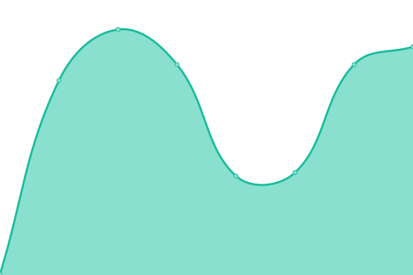 243ms
     
 | 

<a href="https://sumukha.github.io/upptime/history/pryor">100.00%</a>
    

|  [sbpsychotherapy](https://sbpsychotherapy.com) | 🟩 Up | [sbpsychotherapy.yml](https://github.com/Sumukha/upptime/commits/HEAD/history/sbpsychotherapy.yml) | 

 188ms
     
 | 

<a href="https://sumukha.github.io/upptime/history/sbpsychotherapy">100.00%</a>
    

|  [sfdeportationattorney](https://sfdeportationattorney.com) | 🟩 Up | [sfdeportationattorney.yml](https://github.com/Sumukha/upptime/commits/HEAD/history/sfdeportationattorney.yml) | 

 396ms
     
 | 

<a href="https://sumukha.github.io/upptime/history/sfdeportationattorney">100.00%</a>
    

|  [sbnbcc](https://sbnbcc.org) | 🟩 Up | [sbnbcc.yml](https://github.com/Sumukha/upptime/commits/HEAD/history/sbnbcc.yml) | 

 530ms
     
 | 

<a href="https://sumukha.github.io/upptime/history/sbnbcc">100.00%</a>
    

|  [Sedona-farmers-market.com](https://sedona-farmers-market.com) | 🟩 Up | [sedona-farmers-market-com.yml](https://github.com/Sumukha/upptime/commits/HEAD/history/sedona-farmers-market-com.yml) | 

 628ms
     
 | 

<a href="https://sumukha.github.io/upptime/history/sedona-farmers-market-com">100.00%</a>
    

|  [SB Neuro](https://sbneuro.com/) | 🟩 Up | [sb-neuro.yml](https://github.com/Sumukha/upptime/commits/HEAD/history/sb-neuro.yml) | 

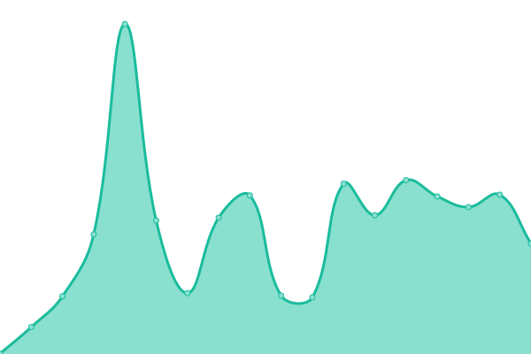 340ms
     
 | 

<a href="https://sumukha.github.io/upptime/history/sb-neuro">100.00%</a>
    

|  [SB Private Chef](https://sb-privatechef.com) | 🟩 Up | [sb-private-chef.yml](https://github.com/Sumukha/upptime/commits/HEAD/history/sb-private-chef.yml) | 

 382ms
     
 | 

<a href="https://sumukha.github.io/upptime/history/sb-private-chef">100.00%</a>
    

|  [SB Webhosting](https://accountant.sb-webhosting.com) | 🟩 Up | [sb-webhosting.yml](https://github.com/Sumukha/upptime/commits/HEAD/history/sb-webhosting.yml) | 

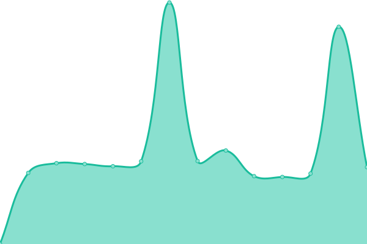 2809ms
     
 | 

<a href="https://sumukha.github.io/upptime/history/sb-webhosting">100.00%</a>
    

|  [SCCSedona](https://sccsedona.org) | 🟩 Up | [scc-sedona.yml](https://github.com/Sumukha/upptime/commits/HEAD/history/scc-sedona.yml) | 

 1137ms
     
 | 

<a href="https://sumukha.github.io/upptime/history/scc-sedona">100.00%</a>
    

|  [Schonfeld](https://schonfeldushan.com) | 🟩 Up | [schonfeld.yml](https://github.com/Sumukha/upptime/commits/HEAD/history/schonfeld.yml) | 

 262ms
     
 | 

<a href="https://sumukha.github.io/upptime/history/schonfeld">100.00%</a>
    

|  [SedonaAuraPhoto](https://sedonaauraphoto.com) | 🟩 Up | [sedona-aura-photo.yml](https://github.com/Sumukha/upptime/commits/HEAD/history/sedona-aura-photo.yml) | 

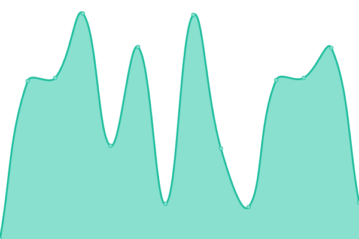 924ms
     
 | 

<a href="https://sumukha.github.io/upptime/history/sedona-aura-photo">100.00%</a>
    

|  [Sharonloy.com](https://sharonloy.com/) | 🟩 Up | [sharonloy-com.yml](https://github.com/Sumukha/upptime/commits/HEAD/history/sharonloy-com.yml) | 

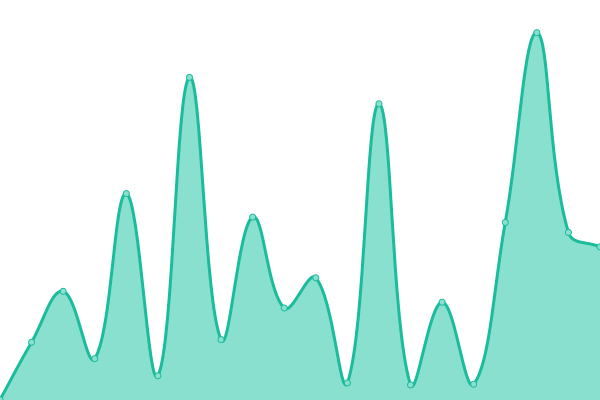 899ms
     
 | 

<a href="https://sumukha.github.io/upptime/history/sharonloy-com">100.00%</a>
    

|  [Visalobo](https://visalobo.com) | 🟩 Up | [visalobo.yml](https://github.com/Sumukha/upptime/commits/HEAD/history/visalobo.yml) | 

 439ms
     
 | 

<a href="https://sumukha.github.io/upptime/history/visalobo">100.00%</a>
    

|  [Visawolf](https://visawolf.com) | 🟩 Up | [visawolf.yml](https://github.com/Sumukha/upptime/commits/HEAD/history/visawolf.yml) | 

 352ms
     
 | 

<a href="https://sumukha.github.io/upptime/history/visawolf">100.00%</a>
    

|  [Yardenlaw](https://yardenlaw.com) | 🟩 Up | [yardenlaw.yml](https://github.com/Sumukha/upptime/commits/HEAD/history/yardenlaw.yml) | 

 997ms
     
 | 

<a href="https://sumukha.github.io/upptime/history/yardenlaw">100.00%</a>
    

|  [Yevoli](https://yevoliandmalayev.com) | 🟩 Up | [yevoli.yml](https://github.com/Sumukha/upptime/commits/HEAD/history/yevoli.yml) | 

 195ms
     
 | 

<a href="https://sumukha.github.io/upptime/history/yevoli">100.00%</a>
    

|  [Google](https://www.google.com) | 🟩 Up | [google.yml](https://github.com/Sumukha/upptime/commits/HEAD/history/google.yml) | 

 86ms
     
 | 

<a href="https://sumukha.github.io/upptime/history/google">100.00%</a>
    

|  [Nonprofit](https://nonprofit-websitedesign.com) | 🟩 Up | [nonprofit.yml](https://github.com/Sumukha/upptime/commits/HEAD/history/nonprofit.yml) | 

 774ms
     
 | 

<a href="https://sumukha.github.io/upptime/history/nonprofit">100.00%</a>
    

<!--end: status pages-->

[**Visit our status website →**](https://Sumukha.github.io/upptime)

## 📄 License

- Powered by: [Upptime](https://github.com/upptime/upptime)
- Code: [MIT](./LICENSE) © [Anand Chowdhary](https://anandchowdhary.com), supported by [Pabio](https://pabio.com)
- Data in the `./history` directory: [Open Database License](https://opendatacommons.org/licenses/odbl/1-0/)
