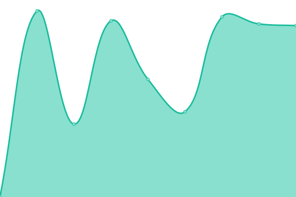

# [📈 Live Status](https://Sumukha.github.io/upptime): <!--live status--> **🟩 All systems operational**

This repository contains the open-source uptime monitor and status page for [Sumukha](https://Sumukha.github.io/upptime), powered by [Upptime](https://github.com/upptime/upptime).

With [Upptime](https://upptime.js.org), you can get your own unlimited and free uptime monitor and status page, powered entirely by a GitHub repository. We use [Issues](https://github.com/Sumukha/upptime/issues) as incident reports, [Actions](https://github.com/Sumukha/upptime/actions) as uptime monitors, and [Pages](https://Sumukha.github.io/upptime) for the status page.

<!--start: status pages-->
<!-- This summary is generated by Upptime (https://github.com/upptime/upptime) -->
<!-- Do not edit this manually, your changes will be overwritten -->
<!-- prettier-ignore -->
| URL | Status | History | Response Time | Uptime |
| --- | ------ | ------- | ------------- | ------ |
|  [AWFL](https://awebsiteforlawyers.com) | 🟩 Up | [awfl.yml](https://github.com/Sumukha/upptime/commits/HEAD/history/awfl.yml) | 

 1108ms
     
 | 

<a href="https://sumukha.github.io/upptime/history/awfl">100.00%</a>
    

|  [SedWeb](https://sedonawebsitedesign.com) | 🟩 Up | [sed-web.yml](https://github.com/Sumukha/upptime/commits/HEAD/history/sed-web.yml) | 

 474ms
     
 | 

<a href="https://sumukha.github.io/upptime/history/sed-web">100.00%</a>
    

|  [SBWeb](https://santabarbara-webdesign.com) | 🟩 Up | [sb-web.yml](https://github.com/Sumukha/upptime/commits/HEAD/history/sb-web.yml) | 

 843ms
     
 | 

<a href="https://sumukha.github.io/upptime/history/sb-web">100.00%</a>
    

|  [Admark](https://admarkimprint.com) | 🟩 Up | [admark.yml](https://github.com/Sumukha/upptime/commits/HEAD/history/admark.yml) | 

 128ms
     
 | 

<a href="https://sumukha.github.io/upptime/history/admark">100.00%</a>
    

|  [Ami Sarasvati](https://amisarasvati.com) | 🟩 Up | [ami-sarasvati.yml](https://github.com/Sumukha/upptime/commits/HEAD/history/ami-sarasvati.yml) | 

 491ms
     
 | 

<a href="https://sumukha.github.io/upptime/history/ami-sarasvati">100.00%</a>
    

|  [ASAP](https://asapcats.org) | 🟩 Up | [asap.yml](https://github.com/Sumukha/upptime/commits/HEAD/history/asap.yml) | 

 661ms
     
 | 

<a href="https://sumukha.github.io/upptime/history/asap">100.00%</a>
    

|  [ANHA](https://aznaturalhistory.org) | 🟩 Up | [anha.yml](https://github.com/Sumukha/upptime/commits/HEAD/history/anha.yml) | 

 579ms
     
 | 

<a href="https://sumukha.github.io/upptime/history/anha">100.00%</a>
    

|  [BigPark](https://bigparkcouncil.org) | 🟩 Up | [big-park.yml](https://github.com/Sumukha/upptime/commits/HEAD/history/big-park.yml) | 

 1497ms
     
 | 

<a href="https://sumukha.github.io/upptime/history/big-park">100.00%</a>
    

|  [Brent W Davis](https://brentwdavis.com) | 🟩 Up | [brent-w-davis.yml](https://github.com/Sumukha/upptime/commits/HEAD/history/brent-w-davis.yml) | 

 527ms
     
 | 

<a href="https://sumukha.github.io/upptime/history/brent-w-davis">100.00%</a>
    

|  [Immigration Lawyer News](https://immigration-lawyer-news.com) | 🟩 Up | [immigration-lawyer-news.yml](https://github.com/Sumukha/upptime/commits/HEAD/history/immigration-lawyer-news.yml) | 

 184ms
     
 | 

<a href="https://sumukha.github.io/upptime/history/immigration-lawyer-news">100.00%</a>
    

|  [iPipoles](https://ipipoles.com) | 🟩 Up | [i-pipoles.yml](https://github.com/Sumukha/upptime/commits/HEAD/history/i-pipoles.yml) | 

 461ms
     
 | 

<a href="https://sumukha.github.io/upptime/history/i-pipoles">100.00%</a>
    

|  [Jacopo](https://jacopogiacopuzzi.com) | 🟩 Up | [jacopo.yml](https://github.com/Sumukha/upptime/commits/HEAD/history/jacopo.yml) | 

 3435ms
     
 | 

<a href="https://sumukha.github.io/upptime/history/jacopo">100.00%</a>
    

|  [Jaimmigration](https://jaimmigrationlaw.com) | 🟩 Up | [jaimmigration.yml](https://github.com/Sumukha/upptime/commits/HEAD/history/jaimmigration.yml) | 

 369ms
     
 | 

<a href="https://sumukha.github.io/upptime/history/jaimmigration">100.00%</a>
    

|  [iPalpiti](https://ipalpiti.org) | 🟩 Up | [i-palpiti.yml](https://github.com/Sumukha/upptime/commits/HEAD/history/i-palpiti.yml) | 

 227ms
     
 | 

<a href="https://sumukha.github.io/upptime/history/i-palpiti">100.00%</a>
    

|  [sbnbcc](https://sbnbcc.org) | 🟩 Up | [sbnbcc.yml](https://github.com/Sumukha/upptime/commits/HEAD/history/sbnbcc.yml) | 

 519ms
     
 | 

<a href="https://sumukha.github.io/upptime/history/sbnbcc">100.00%</a>
    

|  [Visawolf](https://visawolf.com) | 🟩 Up | [visawolf.yml](https://github.com/Sumukha/upptime/commits/HEAD/history/visawolf.yml) | 

 674ms
     
 | 

<a href="https://sumukha.github.io/upptime/history/visawolf">100.00%</a>
    

|  [Google](https://www.google.com) | 🟩 Up | [google.yml](https://github.com/Sumukha/upptime/commits/HEAD/history/google.yml) | 

 102ms
     
 | 

<a href="https://sumukha.github.io/upptime/history/google">100.00%</a>
    

<!--end: status pages-->

[**Visit our status website →**](https://Sumukha.github.io/upptime)

## 📄 License

- Powered by: [Upptime](https://github.com/upptime/upptime)
- Code: [MIT](./LICENSE) © [Anand Chowdhary](https://anandchowdhary.com), supported by [Pabio](https://pabio.com)
- Data in the `./history` directory: [Open Database License](https://opendatacommons.org/licenses/odbl/1-0/)
