# [📈 Live Status](https://Sumukha.github.io/upptime): <!--live status--> **🟧 Partial outage**

This repository contains the open-source uptime monitor and status page for [Sumukha](https://Sumukha.github.io/upptime), powered by [Upptime](https://github.com/upptime/upptime).

With [Upptime](https://upptime.js.org), you can get your own unlimited and free uptime monitor and status page, powered entirely by a GitHub repository. We use [Issues](https://github.com/Sumukha/upptime/issues) as incident reports, [Actions](https://github.com/Sumukha/upptime/actions) as uptime monitors, and [Pages](https://Sumukha.github.io/upptime) for the status page.

<!--start: status pages-->
<!-- This summary is generated by Upptime (https://github.com/upptime/upptime) -->
<!-- Do not edit this manually, your changes will be overwritten -->
<!-- prettier-ignore -->
| URL | Status | History | Response Time | Uptime |
| --- | ------ | ------- | ------------- | ------ |
|  [AWFL](https://awebsiteforlawyers.com) | 🟥 Down | [awfl.yml](https://github.com/Sumukha/upptime/commits/HEAD/history/awfl.yml) | 

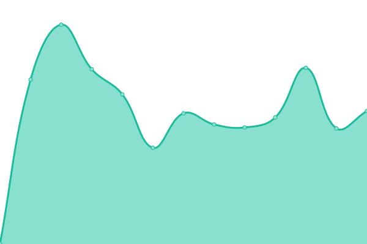 2488ms
     
 | 

<a href="https://sumukha.github.io/upptime/history/awfl">88.45%</a>
    

|  [SedWeb](https://sedonawebsitedesign.com) | 🟥 Down | [sed-web.yml](https://github.com/Sumukha/upptime/commits/HEAD/history/sed-web.yml) | 

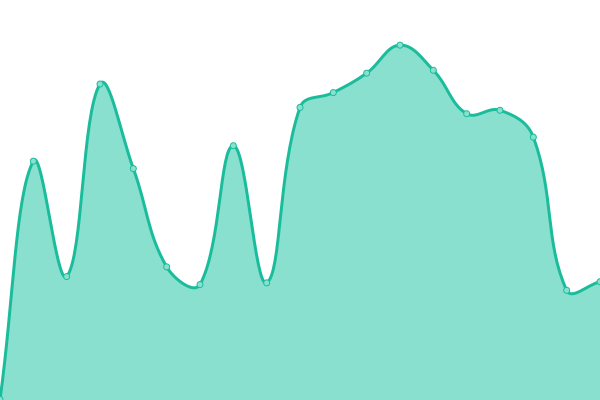 534ms
     
 | 

<a href="https://sumukha.github.io/upptime/history/sed-web">95.16%</a>
    

|  [SBWeb](https://santabarbara-webdesign.com) | 🟥 Down | [sb-web.yml](https://github.com/Sumukha/upptime/commits/HEAD/history/sb-web.yml) | 

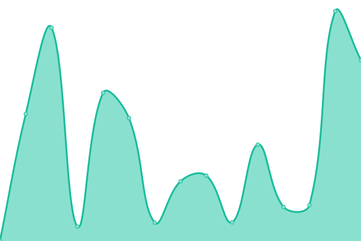 237ms
     
 | 

<a href="https://sumukha.github.io/upptime/history/sb-web">95.16%</a>
    

|  [Admark](https://admarkimprint.com) | 🟥 Down | [admark.yml](https://github.com/Sumukha/upptime/commits/HEAD/history/admark.yml) | 

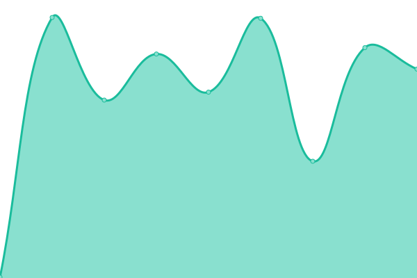 243ms
     
 | 

<a href="https://sumukha.github.io/upptime/history/admark">97.56%</a>
    

|  [appliedintuition.org](https://appliedintuition.org) | 🟥 Down | [appliedintuition-org.yml](https://github.com/Sumukha/upptime/commits/HEAD/history/appliedintuition-org.yml) | 

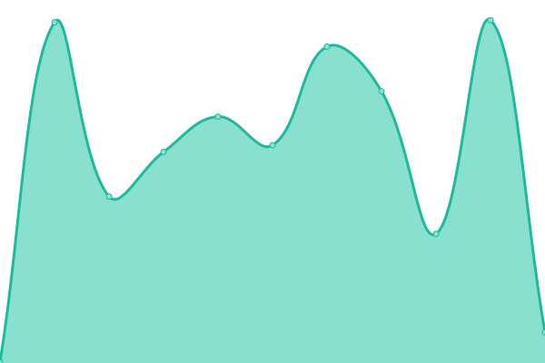 391ms
     
 | 

<a href="https://sumukha.github.io/upptime/history/appliedintuition-org">95.22%</a>
    

|  [ANHA](https://aznaturalhistory.org) | 🟥 Down | [anha.yml](https://github.com/Sumukha/upptime/commits/HEAD/history/anha.yml) | 

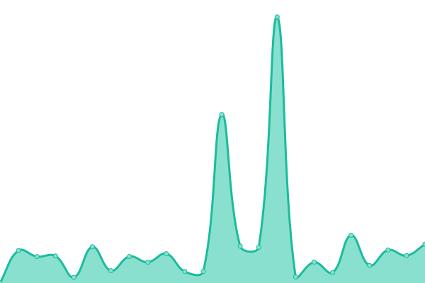 597ms
     
 | 

<a href="https://sumukha.github.io/upptime/history/anha">95.43%</a>
    

|  [auracolorlight.com](https://auracolorlight.com) | 🟥 Down | [auracolorlight-com.yml](https://github.com/Sumukha/upptime/commits/HEAD/history/auracolorlight-com.yml) | 

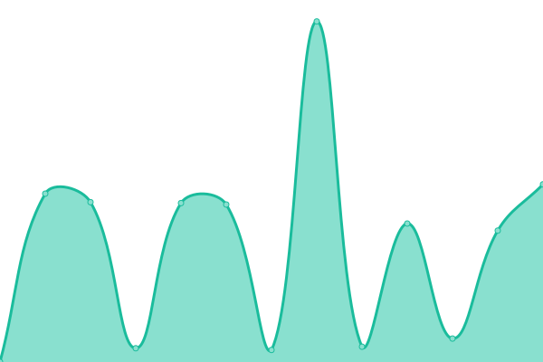 1171ms
     
 | 

<a href="https://sumukha.github.io/upptime/history/auracolorlight-com">97.59%</a>
    

|  [BigPark](https://bigparkcouncil.org) | 🟥 Down | [big-park.yml](https://github.com/Sumukha/upptime/commits/HEAD/history/big-park.yml) | 

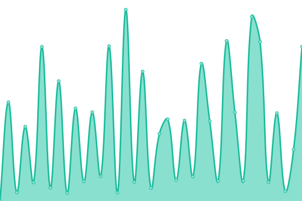 969ms
     
 | 

<a href="https://sumukha.github.io/upptime/history/big-park">97.58%</a>
    

|  [BBFD](https://bodyblissfactorydirect.com/) | 🟥 Down | [bbfd.yml](https://github.com/Sumukha/upptime/commits/HEAD/history/bbfd.yml) | 

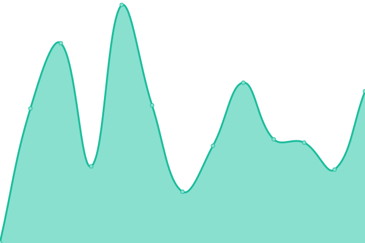 247ms
     
 | 

<a href="https://sumukha.github.io/upptime/history/bbfd">97.58%</a>
    

|  [Brent W Davis](https://brentwdavis.com) | 🟥 Down | [brent-w-davis.yml](https://github.com/Sumukha/upptime/commits/HEAD/history/brent-w-davis.yml) | 

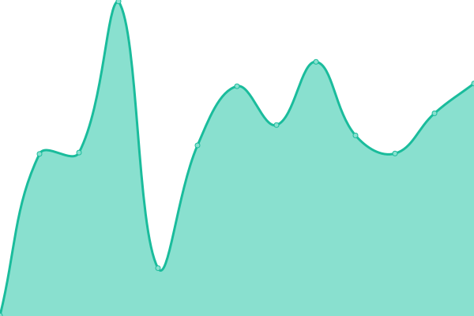 335ms
     
 | 

<a href="https://sumukha.github.io/upptime/history/brent-w-davis">95.48%</a>
    

|  [brigittegarzalaw.com](https://brigittegarzalaw.com) | 🟥 Down | [brigittegarzalaw-com.yml](https://github.com/Sumukha/upptime/commits/HEAD/history/brigittegarzalaw-com.yml) | 

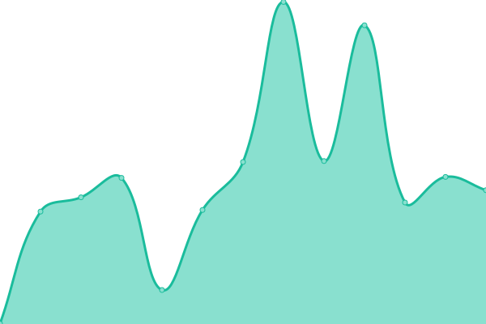 336ms
     
 | 

<a href="https://sumukha.github.io/upptime/history/brigittegarzalaw-com">95.54%</a>
    

|  [Clayton Nolte](https://claytonnolte.com/) | 🟥 Down | [clayton-nolte.yml](https://github.com/Sumukha/upptime/commits/HEAD/history/clayton-nolte.yml) | 

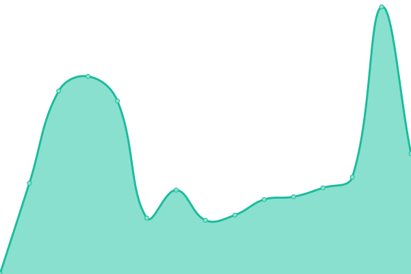 2018ms
     
 | 

<a href="https://sumukha.github.io/upptime/history/clayton-nolte">95.60%</a>
    

|  [Cove Alaska](https://covealaska.com) | 🟥 Down | [cove-alaska.yml](https://github.com/Sumukha/upptime/commits/HEAD/history/cove-alaska.yml) | 

 357ms
     
 | 

<a href="https://sumukha.github.io/upptime/history/cove-alaska">89.21%</a>
    

|  [Dentalstartupguy](https://dentalstartupguy.com/) | 🟥 Down | [dentalstartupguy.yml](https://github.com/Sumukha/upptime/commits/HEAD/history/dentalstartupguy.yml) | 

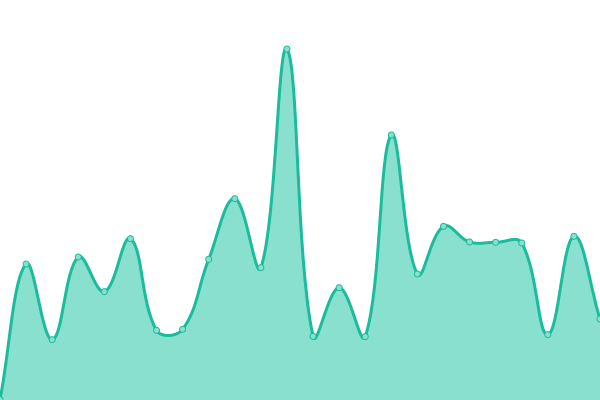 324ms
     
 | 

<a href="https://sumukha.github.io/upptime/history/dentalstartupguy">95.71%</a>
    

|  [Enerpro](https://www.enerpro-inc.com/) | 🟥 Down | [enerpro.yml](https://github.com/Sumukha/upptime/commits/HEAD/history/enerpro.yml) | 

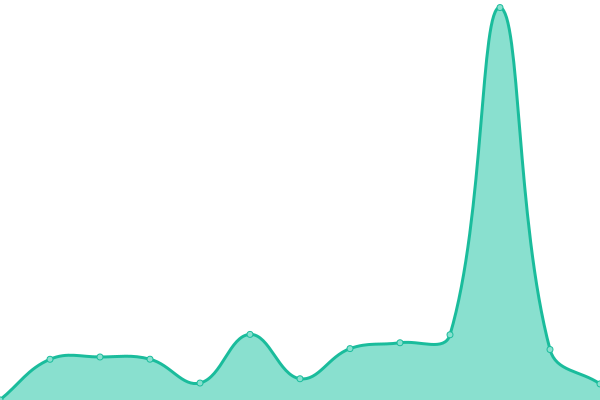 449ms
     
 | 

<a href="https://sumukha.github.io/upptime/history/enerpro">97.47%</a>
    

|  [Earthangelsinsedona](https://earthangelsinsedona.com/) | 🟥 Down | [earthangelsinsedona.yml](https://github.com/Sumukha/upptime/commits/HEAD/history/earthangelsinsedona.yml) | 

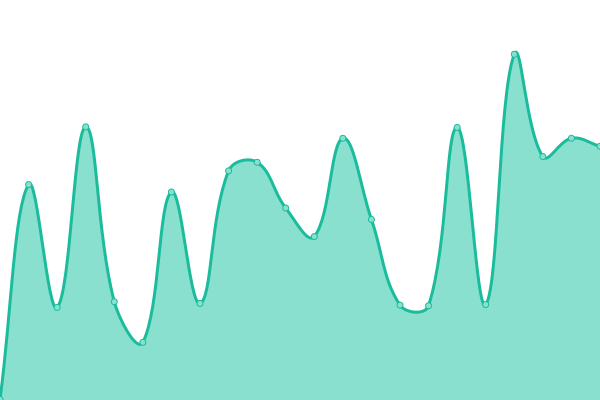 316ms
     
 | 

<a href="https://sumukha.github.io/upptime/history/earthangelsinsedona">95.76%</a>
    

|  [energyempoweredjewelry.com](https://energyempoweredjewelry.com/) | 🟩 Up | [energyempoweredjewelry-com.yml](https://github.com/Sumukha/upptime/commits/HEAD/history/energyempoweredjewelry-com.yml) | 

 2447ms
     
 | 

<a href="https://sumukha.github.io/upptime/history/energyempoweredjewelry-com">100.00%</a>
    

|  [Greenway](https://greenwaybankruptcy.com/) | 🟥 Down | [greenway.yml](https://github.com/Sumukha/upptime/commits/HEAD/history/greenway.yml) | 

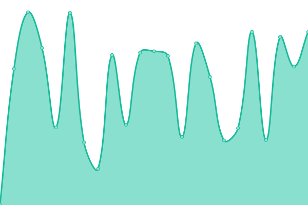 359ms
     
 | 

<a href="https://sumukha.github.io/upptime/history/greenway">95.82%</a>
    

|  [Immigration Lawyer News](https://immigration-lawyer-news.com/) | 🟥 Down | [immigration-lawyer-news.yml](https://github.com/Sumukha/upptime/commits/HEAD/history/immigration-lawyer-news.yml) | 

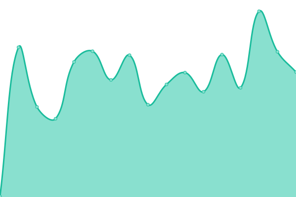 231ms
     
 | 

<a href="https://sumukha.github.io/upptime/history/immigration-lawyer-news">97.68%</a>
    

|  [iPipoles](https://ipipoles.com/) | 🟥 Down | [i-pipoles.yml](https://github.com/Sumukha/upptime/commits/HEAD/history/i-pipoles.yml) | 

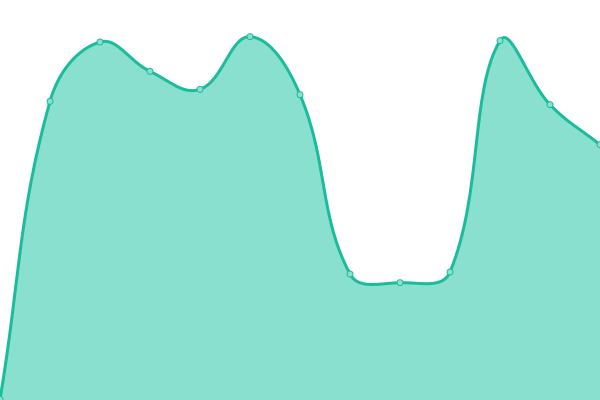 327ms
     
 | 

<a href="https://sumukha.github.io/upptime/history/i-pipoles">95.88%</a>
    

|  [Jacopo](https://jacopogiacopuzzi.com) | 🟥 Down | [jacopo.yml](https://github.com/Sumukha/upptime/commits/HEAD/history/jacopo.yml) | 

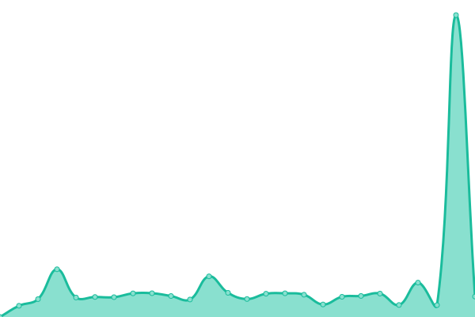 673ms
     
 | 

<a href="https://sumukha.github.io/upptime/history/jacopo">95.94%</a>
    

|  [iPalpiti](https://ipalpiti.org) | 🟥 Down | [i-palpiti.yml](https://github.com/Sumukha/upptime/commits/HEAD/history/i-palpiti.yml) | 

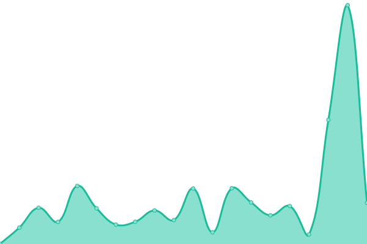 267ms
     
 | 

<a href="https://sumukha.github.io/upptime/history/i-palpiti">97.71%</a>
    

|  [Orozonaoils.com](https://orozonaoils.com/) | 🟥 Down | [orozonaoils-com.yml](https://github.com/Sumukha/upptime/commits/HEAD/history/orozonaoils-com.yml) | 

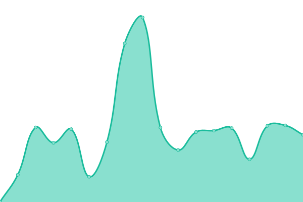 361ms
     
 | 

<a href="https://sumukha.github.io/upptime/history/orozonaoils-com">96.14%</a>
    

|  [Pernicelaw.com](https://pernicelaw.com) | 🟥 Down | [pernicelaw-com.yml](https://github.com/Sumukha/upptime/commits/HEAD/history/pernicelaw-com.yml) | 

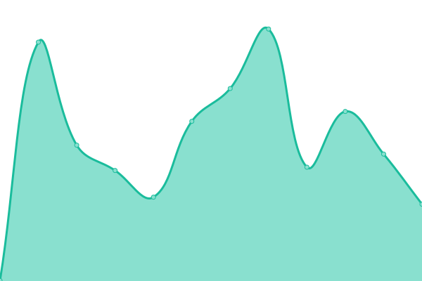 393ms
     
 | 

<a href="https://sumukha.github.io/upptime/history/pernicelaw-com">97.72%</a>
    

|  [Pryor](https://pryorimmigration.com) | 🟩 Up | [pryor.yml](https://github.com/Sumukha/upptime/commits/HEAD/history/pryor.yml) | 

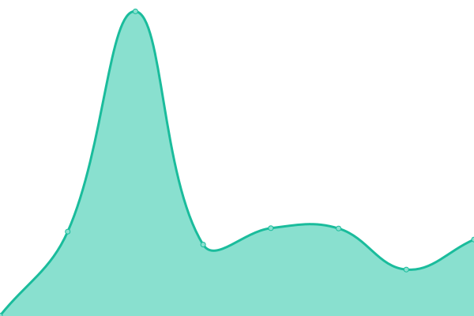 260ms
     
 | 

<a href="https://sumukha.github.io/upptime/history/pryor">100.00%</a>
    

|  [sbpsychotherapy](https://sbpsychotherapy.com) | 🟥 Down | [sbpsychotherapy.yml](https://github.com/Sumukha/upptime/commits/HEAD/history/sbpsychotherapy.yml) | 

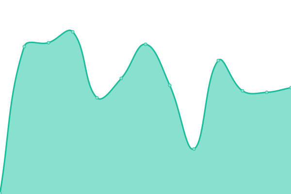 197ms
     
 | 

<a href="https://sumukha.github.io/upptime/history/sbpsychotherapy">97.72%</a>
    

|  [sfdeportationattorney](https://sfdeportationattorney.com) | 🟥 Down | [sfdeportationattorney.yml](https://github.com/Sumukha/upptime/commits/HEAD/history/sfdeportationattorney.yml) | 

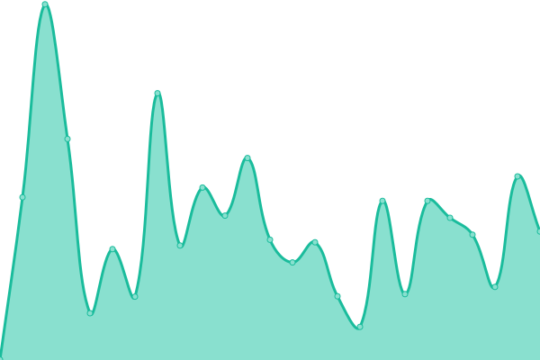 334ms
     
 | 

<a href="https://sumukha.github.io/upptime/history/sfdeportationattorney">96.19%</a>
    

|  [sbnbcc](https://sbnbcc.org) | 🟥 Down | [sbnbcc.yml](https://github.com/Sumukha/upptime/commits/HEAD/history/sbnbcc.yml) | 

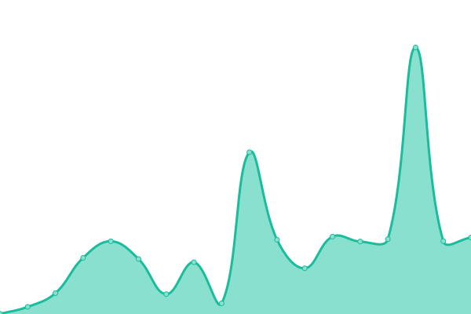 375ms
     
 | 

<a href="https://sumukha.github.io/upptime/history/sbnbcc">96.24%</a>
    

|  [Sedona-farmers-market.com](https://sedona-farmers-market.com) | 🟥 Down | [sedona-farmers-market-com.yml](https://github.com/Sumukha/upptime/commits/HEAD/history/sedona-farmers-market-com.yml) | 

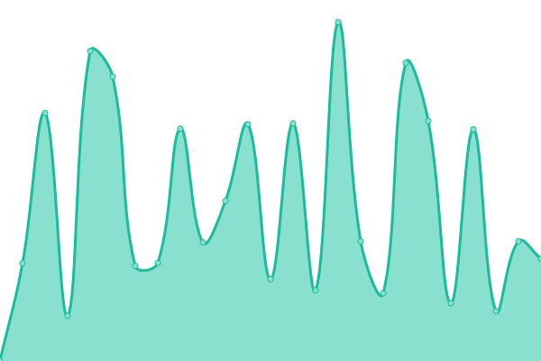 632ms
     
 | 

<a href="https://sumukha.github.io/upptime/history/sedona-farmers-market-com">97.74%</a>
    

|  [SB Neuro](https://sbneuro.com/) | 🟥 Down | [sb-neuro.yml](https://github.com/Sumukha/upptime/commits/HEAD/history/sb-neuro.yml) | 

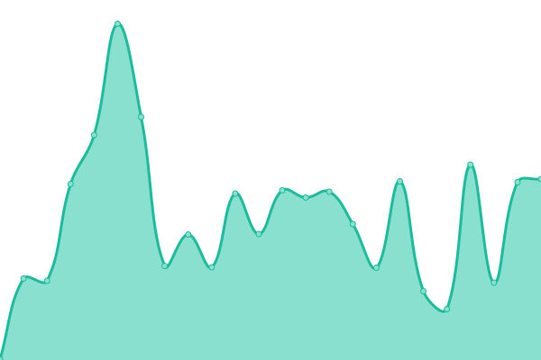 365ms
     
 | 

<a href="https://sumukha.github.io/upptime/history/sb-neuro">96.29%</a>
    

|  [SB Private Chef](https://sb-privatechef.com) | 🟥 Down | [sb-private-chef.yml](https://github.com/Sumukha/upptime/commits/HEAD/history/sb-private-chef.yml) | 

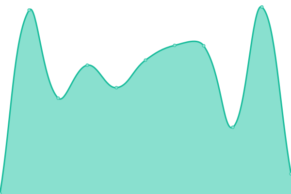 337ms
     
 | 

<a href="https://sumukha.github.io/upptime/history/sb-private-chef">96.35%</a>
    

|  [SB Webhosting](https://accountant.sb-webhosting.com) | 🟥 Down | [sb-webhosting.yml](https://github.com/Sumukha/upptime/commits/HEAD/history/sb-webhosting.yml) | 

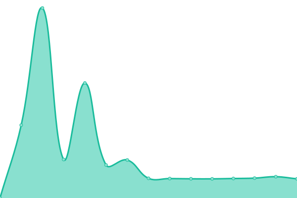 1714ms
     
 | 

<a href="https://sumukha.github.io/upptime/history/sb-webhosting">98.91%</a>
    

|  [SCCSedona](https://sccsedona.org) | 🟩 Up | [scc-sedona.yml](https://github.com/Sumukha/upptime/commits/HEAD/history/scc-sedona.yml) | 

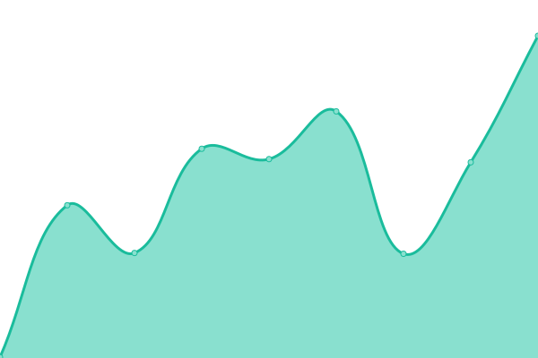 241ms
     
 | 

<a href="https://sumukha.github.io/upptime/history/scc-sedona">99.82%</a>
    

|  [Schonfeld](https://schonfeldushan.com) | 🟥 Down | [schonfeld.yml](https://github.com/Sumukha/upptime/commits/HEAD/history/schonfeld.yml) | 

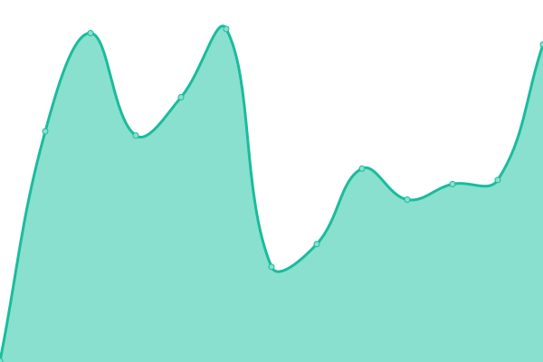 246ms
     
 | 

<a href="https://sumukha.github.io/upptime/history/schonfeld">97.77%</a>
    

|  [SedonaAuraPhoto](https://sedonaauraphoto.com) | 🟥 Down | [sedona-aura-photo.yml](https://github.com/Sumukha/upptime/commits/HEAD/history/sedona-aura-photo.yml) | 

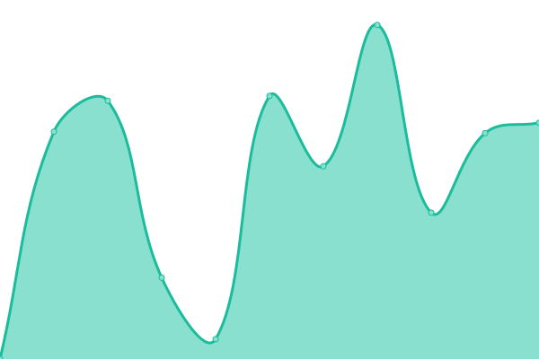 3566ms
     
 | 

<a href="https://sumukha.github.io/upptime/history/sedona-aura-photo">98.92%</a>
    

|  [Sharonloy.com](https://sharonloy.com/) | 🟥 Down | [sharonloy-com.yml](https://github.com/Sumukha/upptime/commits/HEAD/history/sharonloy-com.yml) | 

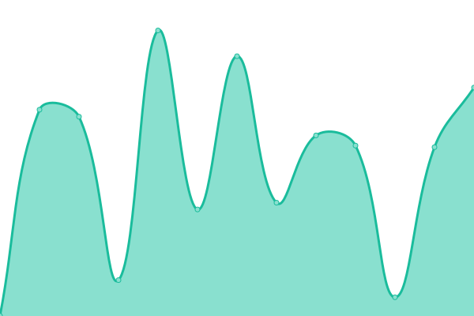 582ms
     
 | 

<a href="https://sumukha.github.io/upptime/history/sharonloy-com">97.78%</a>
    

|  [Visalobo](https://visalobo.com) | 🟥 Down | [visalobo.yml](https://github.com/Sumukha/upptime/commits/HEAD/history/visalobo.yml) | 

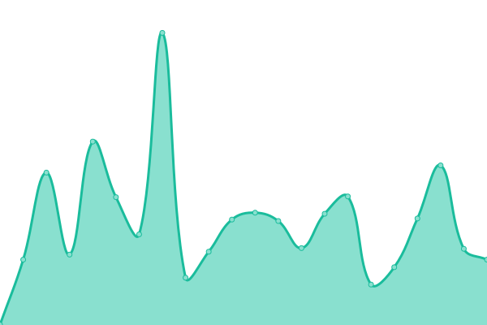 249ms
     
 | 

<a href="https://sumukha.github.io/upptime/history/visalobo">96.37%</a>
    

|  [Visawolf](https://visawolf.com) | 🟥 Down | [visawolf.yml](https://github.com/Sumukha/upptime/commits/HEAD/history/visawolf.yml) | 

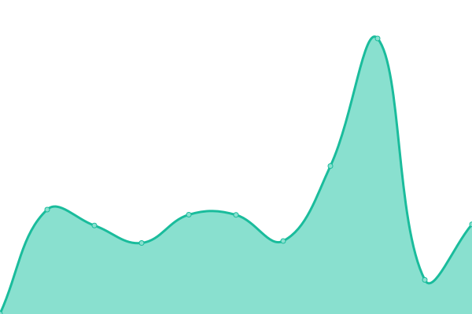 362ms
     
 | 

<a href="https://sumukha.github.io/upptime/history/visawolf">96.43%</a>
    

|  [Yardenlaw](https://yardenlaw.com) | 🟥 Down | [yardenlaw.yml](https://github.com/Sumukha/upptime/commits/HEAD/history/yardenlaw.yml) | 

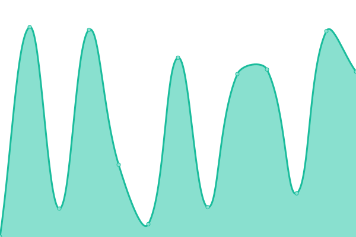 652ms
     
 | 

<a href="https://sumukha.github.io/upptime/history/yardenlaw">97.79%</a>
    

|  [Yevoli](https://yevoliandmalayev.com) | 🟥 Down | [yevoli.yml](https://github.com/Sumukha/upptime/commits/HEAD/history/yevoli.yml) | 

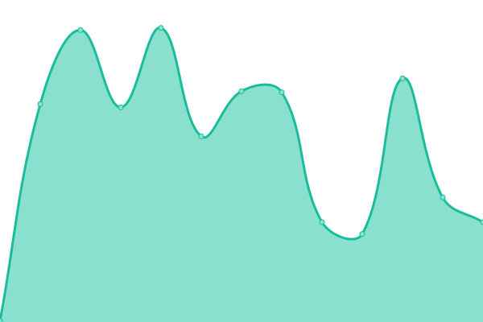 231ms
     
 | 

<a href="https://sumukha.github.io/upptime/history/yevoli">97.79%</a>
    

|  [Google](https://www.google.com) | 🟩 Up | [google.yml](https://github.com/Sumukha/upptime/commits/HEAD/history/google.yml) | 

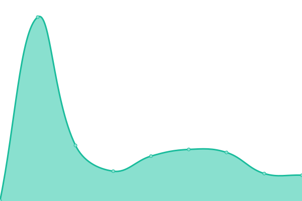 130ms
     
 | 

<a href="https://sumukha.github.io/upptime/history/google">100.00%</a>
    

|  [Nonprofit](https://nonprofit-webdesign.com/) | 🟥 Down | [nonprofit.yml](https://github.com/Sumukha/upptime/commits/HEAD/history/nonprofit.yml) | 

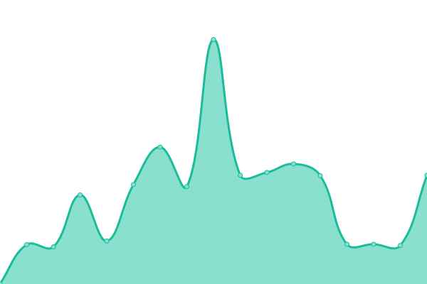 360ms
     
 | 

<a href="https://sumukha.github.io/upptime/history/nonprofit">96.48%</a>
    

<!--end: status pages-->

[**Visit our status website →**](https://Sumukha.github.io/upptime)

## 📄 License

- Powered by: [Upptime](https://github.com/upptime/upptime)
- Code: [MIT](./LICENSE) © [Anand Chowdhary](https://anandchowdhary.com), supported by [Pabio](https://pabio.com)
- Data in the `./history` directory: [Open Database License](https://opendatacommons.org/licenses/odbl/1-0/)
